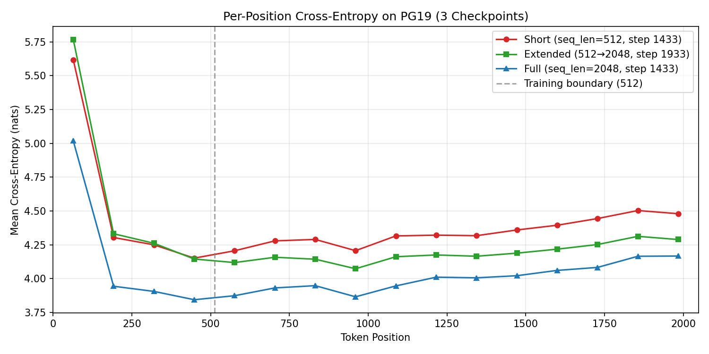
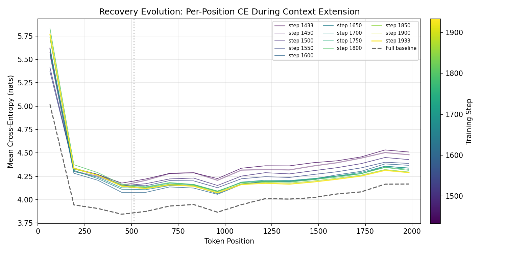
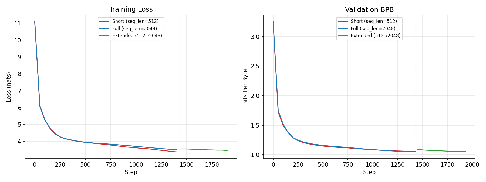
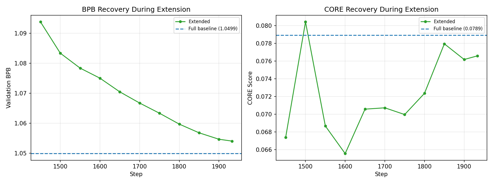

# Part 3: Context Window Extension

## Introduction

Context window extension trains a language model at a short sequence length, then resumes training at a longer sequence length. The hypothesis is that most language knowledge is learned during the short-context phase, and extension mainly teaches the model to attend over longer positions — making it a cheaper alternative to training at full context from the start.

This is well-established in the literature. GrowLength (Jin et al., 2023) demonstrates progressive context growth (e.g. 128→256→512→1024) during pretraining, finding that short-context phases contribute the bulk of capability. SkyLadder (Zhu et al., 2025) confirms that monotonic short-to-long scheduling avoids severe loss spikes. ProLong (Gao et al., 2024) shows that mixing 40% short-context data during extension mitigates forgetting of previously learned capabilities.

We train "picochat" — a smaller nanochat configuration — at sequence length 512, extend to 2048, and compare against training at 2048 from scratch.

## Method

### Model Configuration

Picochat uses nanochat's depth-6 configuration:

| Parameter | Value |
|-----------|-------|
| Depth | 6 |
| Model dim | 384 |
| Attention heads | 3 |
| Head dim | 128 |
| Window pattern | SSSL |
| Total parameters | ~136M |
| Scaling parameters | ~35.8M |
| Data ratio | 10.5 (nanochat default) |
| Target tokens | ~376M |

Depth 6 is the smallest nanochat configuration with 3 attention heads. It is far enough from nanochat's default depth 20 to be useful for P4 scaling law comparison.

### Sequence Length Choice

We chose 512 as the short training length based on two sources:

1. **BabyLM** (Salhan et al., 2025) tests 125M-parameter models across {64, 128, 256, 512, 1024, 2048, 4096, 8192} and recommends 512 as "a safe and efficient baseline across both architectures."
2. **GrowLength** (Jin et al., 2023) validates 2x per-stage jumps as the established baseline. Our 4x jump (512→2048) is the smallest extrapolation beyond their 2x that still delivers meaningful savings.

The assignment also corroborates this choice ("e.g. 512").

### Three-Stage Experiment Design

| Stage | Strategy | seq_len | Steps | Purpose |
|-------|----------|---------|-------|---------|
| 1 | Train from scratch | 512 | 1433 | Short-context pretraining |
| 2 | Resume from Stage 1 | 2048 | 500 (1433→1933) | Context extension (cheap path) |
| 3 | Train from scratch | 2048 | 1433 | Full-context baseline (expensive path) |

Stages 1 and 3 use nanochat's auto-computed iteration count based on the 10.5x data ratio. Stage 2 runs 500 additional steps with `save_every=50` to capture the recovery trajectory at high resolution (10 intermediate checkpoints).

All stages use nanochat's auto-computed batch size (~262,144 tokens) and default learning rate schedule. On resume (Stage 2), nanochat recalculates the LR schedule for `num_iterations=1933`, producing a deliberate rewarm from ~0 to ~0.52 of peak LR at step 1433 — analogous to ProLong's approach.

### Custom Evaluation: Positional Perplexity

We designed a per-position cross-entropy evaluation to directly measure whether the model handles positions beyond its training length:

- **Dataset**: PG19 test split — avoids contamination (nanochat trains on FineWeb-edu) and is standard in context extension literature (Chen et al., 2023; Peng et al., 2023; Ding et al., 2024).
- **Bucketing**: 128-token windows (16 buckets for 2048 tokens). Each bucket reports mean cross-entropy across all documents.
- **Sample**: All 100 documents in PG19 test split, each truncated to 2048 tokens.

We also run nanochat's built-in evaluations:
- **BPB** (bits per byte): Overall language modeling quality on FineWeb-edu validation.
- **CORE** (22 tasks): General task capability. At ~136M params, most tasks are near random — HellaSwag, PIQA, ARC-Easy, and BoolQ are the most informative.

### Checkpoints Evaluated

| Checkpoint | Model Tag | Step | Description |
|------------|-----------|------|-------------|
| Short | pico-short | 1433 | End of Stage 1 (seq_len=512 only) |
| Extended | pico-short | 1933 | End of Stage 2 (512→2048 extension) |
| Full | pico-full | 1433 | End of Stage 3 (2048 from scratch) |

Additionally, 10 intermediate checkpoints during extension (steps 1450–1900, every 50 steps) were evaluated with both custom eval and CORE to track recovery dynamics.

Note: CORE evaluation was not run on the short checkpoint (pico-short@1433) because nanochat's RoPE positional encoding at seq_len=512 cannot process the 2048-token CORE prompts.

## Results

### Per-Position Cross-Entropy

*Figure 1: Per-position cross-entropy on PG19 for three checkpoints. Dashed vertical line marks the 512-token training boundary.*

The short checkpoint (red) shows a gradual upward drift in cross-entropy beyond position 512, rising from ~4.15 at positions 384–512 to ~4.50 at positions 1920–2048 — a +0.35 nats degradation. This is not catastrophic but is consistent: positions the model never trained on are handled worse.

The extended checkpoint (green) improves over short beyond position 512 (mean CE 4.19 vs 4.34, a 0.15 nats improvement), confirming that context extension mechanically worked.

The full checkpoint (blue) achieves the lowest CE at all positions, with a ~0.15–0.25 nats advantage over extended across the entire range — including positions 0–512 where both models had training data.

### Recovery Evolution During Extension

*Figure 2: Per-position cross-entropy at each extension checkpoint (steps 1433–1933). Dashed black line is the full-from-scratch baseline.*

The model improves most rapidly in the first ~150 extension steps (1433→1600). Beyond step 1600, progress continues but slows. The largest gains are at positions 512–1024, where the model transitions from untrained to trained positions.

### Training Curves

*Figure 3: Training loss (left) and validation BPB (right) from W&B. Dotted vertical line marks step 1433 where extension begins.*

Short and full training curves overlap closely — both reach similar loss levels despite different sequence lengths. The extension phase (green, steps 1433–1933) shows a mild increase in training loss at resume (from the 4x context jump and LR rewarm), followed by steady recovery. Validation BPB during extension decreases monotonically toward the full baseline.

### BPB and CORE Recovery

*Figure 4: Validation BPB (left) and CORE score (right) during extension. Dashed blue line is the full-from-scratch baseline.*

BPB recovery is smooth and monotonic, approaching the full baseline (1.0540 vs 1.0499 at convergence). CORE recovery is noisier — expected at this model scale where individual task scores fluctuate — but trends upward, reaching 0.0766 vs the full baseline's 0.0789.

### Summary Table

| Metric | Short (1433) | Extended (1933) | Full (1433) |
|--------|-------------|----------------|-------------|
| Val BPB | 1.0586 | 1.0540 | 1.0499 |
| Train Loss | 3.3921 | 3.4769 | 3.5236 |
| PG19 Aggregate CE | 4.4029 | 4.2980 | 4.0500 |
| PG19 Aggregate PPL | 81.69 | 73.55 | 57.40 |
| CE (pos 0–512) | 4.5811 | 4.6267 | 4.1785 |
| CE (pos 512–2048) | 4.3435 | 4.1884 | 4.0071 |
| CORE | N/A (RoPE limit) | 0.0766 | 0.0789 |

### CORE Per-Task Breakdown

| Task | Extended (1933) | Full (1433) |
|------|----------------|-------------|
| **CORE (aggregate)** | **0.0766** | **0.0789** |
| hellaswag_zeroshot | 0.2810 | 0.2767 |
| arc_easy | 0.4289 | 0.4314 |
| copa | 0.6100 | 0.5500 |
| piqa | 0.5871 | 0.5996 |
| boolq | 0.4529 | 0.5899 |
| winograd | 0.5311 | 0.5018 |
| winogrande | 0.5170 | 0.5043 |
| commonsense_qa | 0.2703 | 0.2817 |
| openbook_qa | 0.2740 | 0.2540 |
| lambada_openai | 0.1820 | 0.1814 |
| bigbench_qa_wikidata | 0.1469 | 0.1284 |
| bigbench_cs_algorithms | 0.3977 | 0.3886 |
| bigbench_dyck_languages | 0.1210 | 0.0530 |
| agi_eval_lsat_ar | 0.2826 | 0.2435 |
| arc_challenge | 0.2304 | 0.2457 |
| bigbench_language_identification | 0.2574 | 0.2526 |
| bigbench_operators | 0.0667 | 0.0667 |
| squad | 0.0035 | 0.0033 |
| coqa | 0.0256 | 0.0370 |
| jeopardy | 0.0005 | 0.0019 |
| bigbench_repeat_copy_logic | 0.0000 | 0.0000 |

Most per-task scores are within noise of each other. The largest differences (boolq: 0.4529 vs 0.5899; copa: 0.6100 vs 0.5500) go in opposite directions, consistent with variance at this model scale rather than systematic capability differences.

## Discussion

### Did Context Extension Work?

**Yes, partially.** The custom evaluation confirms that extension improves the model's handling of long positions. The short checkpoint shows a gradual +0.35 nats degradation beyond position 512, while the extended checkpoint reduces this to a flatter profile (mean CE 4.19 vs 4.34 beyond 512).

However, the degradation is not the "catastrophic" spike we predicted based on GrowLength's observations of 8x jumps. At our 4x ratio (512→2048), RoPE extrapolation degrades gracefully rather than diverging. This suggests that GrowLength's findings about "dramatic loss rising" are ratio-dependent, with 4x falling within RoPE's extrapolation tolerance at this model scale.

### Cheap Path vs Expensive Path

The cheap path (512→2048 extension) approaches but does not fully match the expensive path (2048 from scratch):

- **BPB**: 1.0540 vs 1.0499 — a 0.0042 gap. Close enough for practical purposes.
- **CORE**: 0.0766 vs 0.0789 — within noise at this model scale.
- **PG19 perplexity**: 73.55 vs 57.40 — a 28% gap. This is the largest difference.

The persistent PG19 gap exists at all positions, including 0–512 where both models had training data. This indicates the gap is not solely about positional extrapolation — it reflects weaker representations from the extension pathway. ProLong (Gao et al., 2024) identifies this as forgetting: without short-context data mixing during extension, the model partially unlearns what it knew. Nanochat does not support data mixing, so this forgetting is unmitigated.

### Compute Efficiency

Extension saved compute relative to full training: Stage 2 ran 500 steps at seq_len=2048 vs Stage 3's 1433 steps at seq_len=2048 — roughly 65% fewer long-context training steps. Whether this saving justifies the PG19 gap depends on the application. For BPB and CORE (general capability), the cheap path is viable. For tasks requiring strong long-context performance, training from scratch is preferable.

### Limitations

1. **No short-context data mixing**: ProLong's 40% mixing strategy is unavailable in nanochat. This likely explains the persistent gap.
2. **Single model scale**: Results may differ at larger scales where RoPE extrapolation behavior changes.
3. **Single jump ratio**: We tested only 4x (512→2048). GrowLength's progressive schedule (2x per stage) may produce better results.
4. **PG19 only**: The custom eval uses a single long-document dataset. Results on other domains may differ.

### Implications for P4

The picochat checkpoint provides P4 with:
- A data point for scaling law prediction: 35.8M scaling parameters with val_bpb = 1.0499 (full) or 1.0540 (extended)
- A smaller model for emergent abilities comparison against nanochat (depth 20)
- Evidence that depth-6 picochat is a well-trained model at its scale, not undertrained or misconfigured

## Cost Report

All training and evaluation ran on A100-80GB GPUs via Modal.

| Run | GPU-Hours | Description |
|-----|----------|-------------|
| Pipeline (baseline) | ~1.51 | 3 stages + 3 evals |
| Pipeline (CORE recovery) | ~1.34 | 10 CORE evals at intermediate steps |
| Debug / failed attempts | ~1.83 | 13 smaller runs (OOM fixes, RoPE debugging, etc.) |
| **Total** | **4.67** | **15 Modal app runs** |

Estimated cost: $29.77 at A100-80GB rates ($6.37/hr).

The two successful pipeline runs used ~2.85 GPU-hours total, within the pre-estimated range of ~1–1.5 hours per pipeline. Debug runs account for 39% of total cost — expected for a first-time pipeline with multiple failure modes (OOM on A100-40GB, RoPE overflow for short-context CORE, nanochat import paths, BFloat16 autocast).

### W&B Runs

- **p3-baseline-short**: [wandb.ai/seonghyun-ban-uoft/490-autobook-a3/runs/mpaiemt0](https://wandb.ai/seonghyun-ban-uoft/490-autobook-a3/runs/mpaiemt0)
- **p3-baseline-extended**: [wandb.ai/seonghyun-ban-uoft/490-autobook-a3/runs/woxwtud7](https://wandb.ai/seonghyun-ban-uoft/490-autobook-a3/runs/woxwtud7)
- **p3-baseline-full**: [wandb.ai/seonghyun-ban-uoft/490-autobook-a3/runs/wy8sw0zf](https://wandb.ai/seonghyun-ban-uoft/490-autobook-a3/runs/wy8sw0zf)

## References

1. Jin, H., Han, X., Yang, J., Jiang, Z., Chang, C.-Y., & Hu, X. (2023). *GrowLength: Accelerating LLMs Pretraining by Progressively Growing Training Length*. arXiv:2310.00576.
2. Zhu, T., Liu, Q., Wang, H., Chen, S., Gu, X., Pang, T., & Kan, M.-Y. (2025). *SkyLadder: Better and Faster Pretraining via Context Window Scheduling*. NeurIPS 2025. arXiv:2503.15450.
3. Gao, T., Wettig, A., Yen, H., & Chen, D. (2024). *How to Train Long-Context Language Models (Effectively)*. ACL 2025. arXiv:2410.02660.
4. Salhan, S., Diehl Martinez, R., Goriely, Z., & Buttery, P. (2025). *What is the Best Sequence Length for BabyLM?* BabyLM Workshop @ EMNLP 2025. arXiv:2510.19493.
5. Hoffmann, J., Borgeaud, S., Mensch, A., et al. (2022). *Training Compute-Optimal Large Language Models*. NeurIPS 2022. arXiv:2203.15556.
6. Chen, S., Wong, S., Chen, L., & Tian, Y. (2023). *Extending Context Window of Large Language Models via Positional Interpolation*. arXiv:2306.15595.
7. Peng, B., Quesnelle, J., Fan, H., & Shippole, E. (2023). *YaRN: Efficient Context Window Extension of Large Language Models*. ICLR 2024. arXiv:2309.00071.
8. Ding, Y., Zhang, L., Jia, C., et al. (2024). *LongRoPE: Extending LLM Context Window Beyond 2 Million Tokens*. arXiv:2402.13753.
